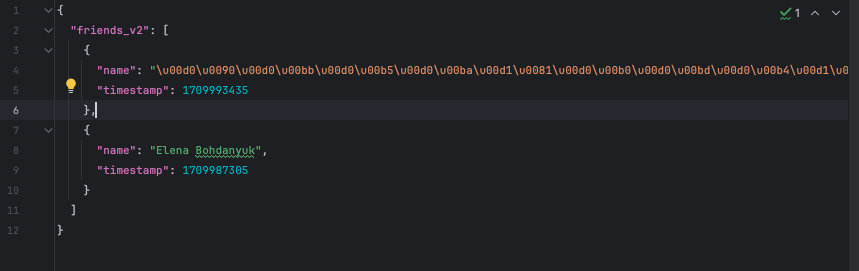
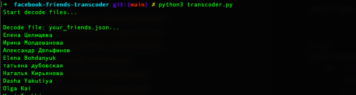

# facebook-friends-decoder
 
## Facebook contact list transcoder

### Problem: 

in Facebook backup files, the data is written in an “unreadable format” in Unicode encoding. 

This utility helps you quickly read data from downloaded files.

### Usage:

Put the backup files to **data** folder

Run:

> python3 transcoder.py

File examples placed in **examples** folder.

### Result:

